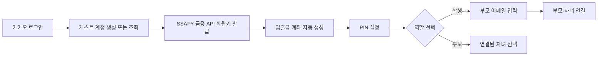
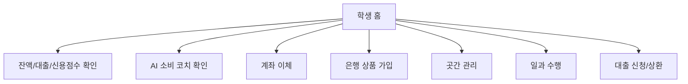
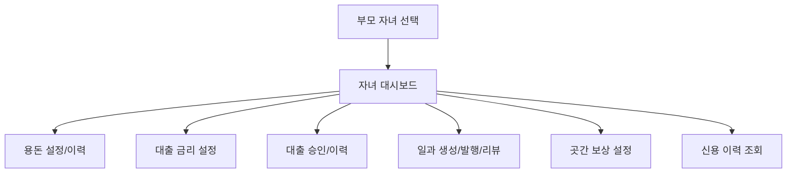
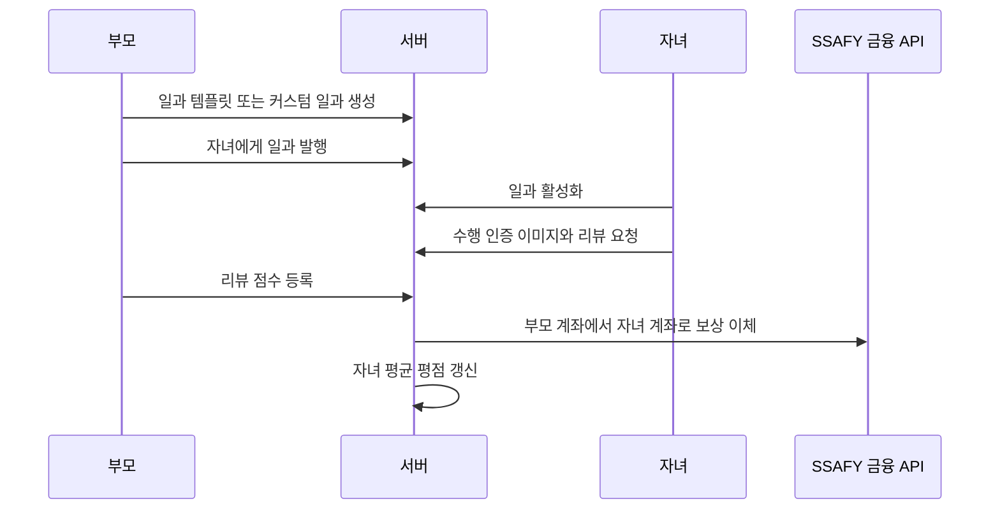
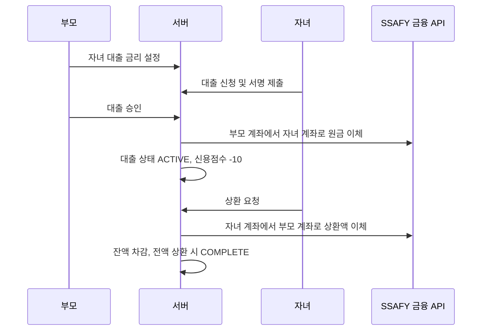
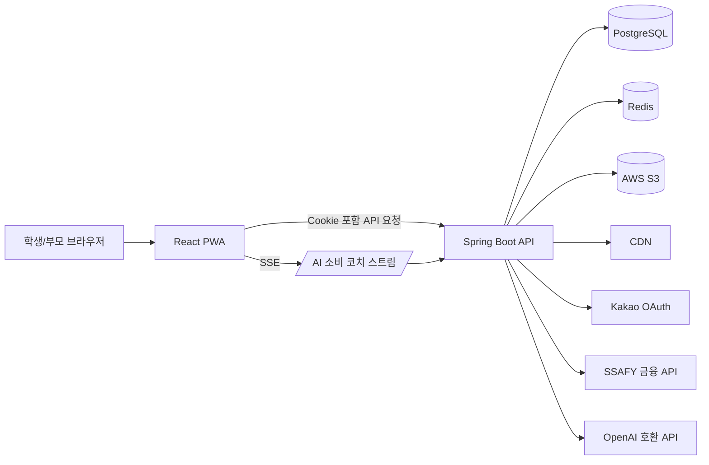

# 용돈농장

용돈농장은 중고등학생이 실제 금융 활동을 작게 경험하면서 소비, 저축, 대출, 상환, 신용 관리의 책임을 배울 수 있도록 만든 금융 교육 플랫폼입니다. 학생은 용돈을 받고, 일과를 수행해 보상을 받고, 예적금 상품에 가입하고, 부모가 설정한 한도 안에서 대출과 상환을 경험합니다. 부모는 자녀의 금융 활동을 함께 관리하며 용돈, 일과, 금리, 보상, 평점을 설정합니다.

발표 자료의 핵심 문제의식은 "청소년은 이미 실전 금융 소비자이지만, 경제 이해력은 충분히 따라오지 못하고 있다"는 점입니다. 미성년 계좌 수 증가, 중고등학생 경제 이해력 하락, 청소년 불법 대리입금 등 사회적 문제를 배경으로, 용돈농장은 단순한 용돈 관리 앱보다 한 단계 더 나아가 책임 있는 금융 경험 자체를 제공하는 것을 목표로 합니다.

## 목차

- [서비스 개요](#서비스-개요)
- [핵심 기능](#핵심-기능)
- [사용자 흐름](#사용자-흐름)
- [기술 스택](#기술-스택)
- [아키텍처](#아키텍처)
- [프로젝트 구조](#프로젝트-구조)
- [백엔드 개발 내용](#백엔드-개발-내용)
- [프론트엔드 개발 내용](#프론트엔드-개발-내용)
- [API 요약](#api-요약)
- [데이터 모델](#데이터-모델)
- [실행 방법](#실행-방법)
- [배포](#배포)
- [개선 포인트](#개선-포인트)

## 서비스 개요

### 문제 정의

발표 자료 기준으로 서비스는 다음 문제를 해결하려고 합니다.

- 청소년은 미성년 계좌, 간편결제, 용돈 송금 등을 통해 이미 돈을 쓰는 실전 금융 소비자입니다.
- 중고등학생의 경제 이해력은 2022년 대비 2023년에 하락했습니다. 발표 자료는 중학생 58.3점에서 51.9점, 고등학생 56.7점에서 51.7점으로 낮아졌다고 설명합니다.
- 금융 이해력 부족은 무계획 소비, 불법 대리입금, 과소비, 부모와의 갈등 같은 문제로 이어질 수 있습니다.
- 청소년 금융 교육은 지식 전달보다 실제 돈의 흐름과 책임을 경험하는 방식이 효과적입니다.

### 해결 방향

용돈농장은 금융 활동을 농장 성장 경험으로 풀어냅니다.

- 용돈은 학생의 기본 자산이 됩니다.
- 예금과 적금은 "곳간"에 쌓이는 자산입니다.
- 일과는 부모가 주는 미션이며, 완료 후 보상과 평점으로 이어집니다.
- 대출은 부모가 승인하는 마이너스 통장 형태의 책임 경험입니다.
- 신용점수와 평점은 꾸준한 금융 행동의 결과를 보여줍니다.
- AI 코치는 최근 거래 내역을 기반으로 오늘의 소비 습관을 짧고 친근하게 피드백합니다.

## 핵심 기능

### 학생 기능

- 카카오 로그인 후 PIN 설정 및 학생 역할 선택
- 부모 이메일을 통한 부모-자녀 연결
- 입출금 계좌 잔액, 대출 잔액, 신용점수, AI 소비 코치 확인
- 계좌 거래 내역 조회 및 계좌 이체
- 예금/적금 상품 목록 조회, 상세 약관 확인, 서명 이미지 기반 가입
- 가입한 예금/적금의 거래 내역, 약관, 보상 확인 및 해지
- 부모가 발행한 일과 수락, 수행, 인증 이미지 업로드, 리뷰 요청
- 부모가 설정한 금리로 대출 신청, 승인 후 상환

### 부모 기능

- 연결된 자녀 목록 조회 및 자녀 선택
- 자녀 홈에서 계좌/신용/일과/대출/곳간 상태 확인
- 정기 용돈 금액과 지급일 설정
- 용돈 지급 이력 조회
- 자녀 대출 금리 설정 및 대출 승인
- 자녀 대출 목록, 대기 중 대출, 상환 이력 조회
- 일과 템플릿 조회, 커스텀 일과 생성, 발행, 취소, 리뷰
- 일과 완료 리뷰 점수를 기반으로 자녀 평점 관리
- 자녀의 예금/적금 곳간 조회 및 보상 문구 설정

### 금융 교육 장치

- 예금/적금 상품은 신용점수 조건, 기간, 금리, 가입 금액 범위를 갖습니다.
- 신용점수가 낮으면 상위 상품에 가입할 수 없습니다.
- 예금/적금 만기 완료 시 신용점수가 상승하고, 중도 해지 시 하락합니다.
- 대출이 승인되면 신용점수가 감소하여 "빌리는 일의 책임"을 경험하게 합니다.
- 대출 상환 내역은 별도 장부로 남아 잔액과 상환 흐름을 확인할 수 있습니다.

## 사용자 흐름

### 온보딩



### 학생 홈 흐름



### 부모 관리 흐름



### 일과 흐름



### 대출 흐름



## 기술 스택

### Backend

| 영역 | 기술 |
| --- | --- |
| Language | Java 21 |
| Framework | Spring Boot 3.5.11 |
| Security | Spring Security, OAuth2 Client, JWT, HttpOnly Cookie |
| Persistence | Spring Data JPA, Querydsl 6.10.1 |
| Database | PostgreSQL 15, pgvector 이미지 사용 |
| Cache | Redis |
| AI | Spring AI OpenAI, Server-Sent Events |
| External API | SSAFY 금융망 API, Kakao OAuth |
| Storage | AWS S3 Presigned URL, CDN URL |
| Docs | Springdoc OpenAPI Swagger UI |
| Build | Gradle |
| Deploy | Docker, Docker Compose, Jenkins, Docker Hub, EC2 |

### Frontend

| 영역 | 기술 |
| --- | --- |
| Language | TypeScript |
| Framework | React 19 |
| Bundler | Vite 8 |
| Routing | React Router 7 |
| Data Fetch | Fetch API, TanStack React Query |
| State | React State, localStorage, Zustand dependency 포함 |
| Styling | Tailwind CSS 4, CSS Modules 형태의 컴포넌트 스타일 |
| Motion | Framer Motion |
| PWA | vite-plugin-pwa |
| Assets | SVG, PNG, SVGR |

## 아키텍처



### 요청 처리 특징

- 인증은 카카오 OAuth2 로그인 후 서버가 Access Token과 Refresh Token을 HttpOnly, Secure, SameSite=None 쿠키로 내려주는 방식입니다.
- Access Token에는 `userId`, `userKey`, `role`이 들어갑니다.
- Refresh Token은 Redis에 SHA-256 해시로 저장하고, 재발급 시 회전합니다.
- 프론트엔드는 401 응답을 받으면 `/users/reissue`를 한 번 호출한 뒤 원래 요청을 재시도합니다.
- 공통 응답은 `{ statusCode, message, data, errorCode }` 형태의 `ResponseBody`로 감쌉니다.
- 외부 금융 API 호출은 SSAFY 클라이언트 계층에서 요청/응답 로깅, HTTP 오류 파싱, 빈 응답 검증을 처리합니다.

## 프로젝트 구조

```text
YongdonFarm
├─ backend/yongdonfarm
│  ├─ src/main/java/site/yongdonfarm
│  │  ├─ ai                # AI 소비 분석, SSE, Redis 캐시/락
│  │  ├─ common            # 공통 응답, 예외, 설정
│  │  ├─ credit            # 신용점수 이력 및 점수 반영
│  │  ├─ demand_deposit    # 입출금 계좌, 송금, 거래 내역
│  │  ├─ deposit           # 예금 상품/가입/해지/내역
│  │  ├─ external/ssafy    # SSAFY 금융 API 클라이언트
│  │  ├─ loan              # 부모 승인 대출, 상환, 거래 장부
│  │  ├─ parent            # 부모 홈, 용돈, 곳간, 금리 설정
│  │  ├─ quest             # 일과 템플릿, 발행, 수행, 리뷰
│  │  ├─ s3                # 이미지 Presigned URL
│  │  ├─ saving            # 적금 상품/가입/해지/내역
│  │  ├─ security          # OAuth2, JWT, 쿠키, 재발급
│  │  └─ user              # 사용자, 자녀, 역할, 자산 조회
│  ├─ build.gradle
│  ├─ Dockerfile
│  ├─ compose.yml
│  ├─ Jenkinsfile-dev
│  └─ Jenkinsfile-release
├─ frontend/yongdonfarm
│  ├─ src
│  │  ├─ api               # 백엔드 API 클라이언트
│  │  ├─ assets            # 아이콘/이미지
│  │  ├─ components        # 공통, 홈, 일과, 상품 컴포넌트
│  │  ├─ constants         # 화면 상수와 상품/일과 데이터
│  │  ├─ pages             # 라우트별 페이지
│  │  └─ types
│  ├─ package.json
│  └─ vite.config.ts
├─ exec
│  ├─ application.yml      # 배포/로컬 설정 예시
│  ├─ compose.infra.yml    # PostgreSQL, Redis
│  ├─ compose.prod.yml     # 배포용 backend compose
│  └─ postgres_*.sql       # DB 덤프 및 초기 데이터
├─ TIL
└─ report.pdf              # 최종 발표 자료
```

## 백엔드 개발 내용

### 인증 및 사용자

- 카카오 OAuth2 로그인으로 소셜 사용자 정보를 받아옵니다.
- 최초 로그인 사용자는 `ROLE_GUEST`로 생성됩니다.
- SSAFY 금융 API 회원을 조회하거나 생성해 `userKey`를 저장합니다.
- 입출금 계좌가 없으면 기본 입출금 계좌를 자동 개설합니다.
- 사용자는 PIN을 설정하고, 학생 또는 부모 역할을 선택합니다.
- 학생 역할 선택 시 `child` 레코드를 생성합니다.
- 학생은 부모 이메일을 입력해 부모 계정과 연결됩니다.

관련 코드:

- `UserService`
- `CustomLoginSuccessHandler`
- `AuthService`
- `TokenProvider`
- `JwtAuthenticationFilter`

### 입출금 계좌와 송금

- SSAFY 입출금 계좌 API를 통해 잔액, 예금주명, 거래 내역을 조회합니다.
- 송금 전 출금 계좌가 로그인 사용자의 계좌인지 검증합니다.
- 같은 계좌 간 송금은 차단합니다.
- 자녀가 송금하면 당일 AI 소비 코치 캐시를 삭제해 최신 거래 내역으로 다시 분석하게 합니다.

주요 메모 타입:

- `ALLOWANCE`: 용돈 지급
- `QUEST_REWARD`: 일과 보상
- `LOAN_DEPOSIT`: 대출 승인 입금
- `LOAN_WITHDRAW`: 대출 승인 출금
- `LOAN_REPAYMENT`: 대출 상환

### 예금

- 예금 상품은 DB에 저장된 내부 상품과 SSAFY 금융 API의 실제 예금 상품을 이름으로 매칭합니다.
- 상품은 금리, 기간, 최소/최대 금액, 최소 신용점수, 약관, 신용점수 증가/감소 값을 가집니다.
- 가입 시 자녀 신용점수와 가입 금액 범위를 검증합니다.
- 이미 활성 상태로 가입한 같은 상품은 중복 가입할 수 없습니다.
- 가입 시 SSAFY 예금 계좌를 생성하고, 내부 `child_deposit`에 시작일/만기일/서명 이미지를 저장합니다.
- 해지 시 만기 전이면 `TERMINATED` 처리와 신용점수 감소, 만기 이후면 `COMPLETE` 처리와 신용점수 증가가 일어납니다.

초기 데이터 기준 예금 상품은 20개이며, 금리 2%부터 13%, 기간 30일부터 120일, 최소 신용점수 0부터 950까지 단계적으로 구성되어 있습니다.

### 적금

- 적금 상품은 예금과 유사하지만 매일 자동 이체되는 적립형 상품으로 모델링되어 있습니다.
- 가입 시 SSAFY 적금 계좌를 생성하고, 내부 `child_saving`에 가입 상태를 저장합니다.
- 거래 내역 조회 시 SSAFY 적금 납입 내역을 가져와 기간, 입출금 유형, 정렬 조건으로 가공합니다.
- 해지/만기 완료에 따라 신용점수 증감 이력을 남깁니다.

초기 데이터 기준 적금 상품은 20개이며, 금리 7%부터 16%, 기간 7일부터 360일, 최소 신용점수 0부터 950까지 구성되어 있습니다.

### 곳간

곳간은 자녀가 가입한 예금/적금 자산을 부모와 자녀가 확인하는 영역입니다.

- 부모는 자녀의 활성 예금/적금을 조회합니다.
- 실제 잔액과 금리는 SSAFY 계좌 조회 결과를 사용합니다.
- 내부 상품명과 외부 계좌명을 매칭해 곳간 목록을 구성합니다.
- 부모는 각 곳간 항목에 보상 문구를 등록하거나 삭제할 수 있습니다.

### 일과

일과는 자녀가 수행할 수 있는 금융 보상형 미션입니다.

- 기본 템플릿 카테고리: `HOUSEHOLD`, `STUDY`, `LIFE`
- 부모는 기본 템플릿으로 자녀용 일과 템플릿을 만들거나 커스텀 일과를 생성합니다.
- 부모가 일과를 발행하면 `child_quest`가 `WAIT` 상태로 생성됩니다.
- 자녀는 일과를 `ACTIVE`로 활성화하거나 다시 `WAIT`로 되돌릴 수 있습니다.
- 자녀가 수행 후 이미지 URL을 첨부해 리뷰 요청을 보내면 상태가 `REQUEST`가 됩니다.
- 부모가 리뷰 점수를 등록하면 보상이 이체되고, 상태가 `COMPLETE`가 됩니다.
- 완료된 리뷰 점수 평균은 자녀의 평점으로 반영됩니다.

초기 일과 템플릿은 12개입니다.

| 카테고리 | 예시 |
| --- | --- |
| 가사분담 | 분리수거의 달인, 세탁물 정리 정돈, 식사 후 뒷정리, 반려견 산책 가이드 |
| 학업및자기계발 | 딥 워크 1시간, 오늘의 뉴스 요약, 오답 노트 정리, 독서 30분 |
| 가족및생활 | 이색 요리사, 부모님 안마 서비스, 디지털 디톡스, 장보기 심부름 |

### 대출

대출은 발표 자료의 "마이너스 통장" 콘셉트를 부모 승인형 대출로 구현한 기능입니다.

- 부모가 자녀별 대출 금리를 설정합니다.
- 자녀는 대출명, 원금, 서명 이미지를 포함해 대출을 신청합니다.
- 신청 상태는 `WAIT`입니다.
- 부모가 승인하면 부모 입출금 계좌에서 자녀 입출금 계좌로 원금이 이체됩니다.
- 승인된 대출은 `ACTIVE`가 되고, 대출 거래 장부에 최초 원금 입금 이력이 저장됩니다.
- 대출 승인 시 자녀 신용점수는 10점 하락합니다.
- 자녀가 상환하면 자녀 계좌에서 부모 계좌로 상환액이 이체되고, 잔액이 차감됩니다.
- 잔액이 0원이 되면 대출 상태가 `COMPLETE`가 됩니다.

### 신용점수와 평점

신용점수와 평점은 서로 다른 지표입니다.

- 신용점수는 0부터 1000 사이로 관리됩니다.
- 자녀 생성 시 기본 신용점수는 500점입니다.
- 예금/적금 만기 완료, 중도 해지, 대출 승인 같은 금융 이벤트가 신용점수 이력으로 저장됩니다.
- `credit_score`에는 변경 전 점수, 변경량, 증가/감소 타입, 이벤트 타입, 이벤트 ID가 기록됩니다.
- 평점은 일과 리뷰 점수의 평균이며 1자리 소수로 반올림됩니다.

### AI 소비 코치

AI 코치는 최근 거래 내역을 기반으로 오늘의 소비를 3줄로 요약합니다.

- `/ai-chat/stream`은 SSE로 `connected`, `started`, `chunk`, `completed`, `cached`, `error` 이벤트를 전송합니다.
- 최근 거래 내역이 없으면 거래 내역 없음 메시지를 반환합니다.
- 거래 내역은 JSON으로 직렬화되어 프롬프트에 삽입됩니다.
- 프롬프트는 반드시 3줄만 출력하도록 제한합니다.
- Redis에 사용자별 당일 AI 코치 결과를 자정까지 캐시합니다.
- 동시에 여러 생성 요청이 들어오면 Redis 락으로 중복 호출을 막습니다.
- 송금, 일과 보상, 대출 승인/상환처럼 거래가 바뀌는 행동 후에는 당일 캐시와 락을 삭제합니다.

### 이미지 업로드

- 인증 이미지는 S3 Presigned PUT URL을 통해 업로드합니다.
- 서버는 파일명, Content-Type, 확장자, 최대 파일 크기를 검증합니다.
- 저장 키는 `app.aws.prefix` 아래 생성되며, 응답에는 업로드 URL과 CDN 기반 조회 URL이 포함됩니다.

## 프론트엔드 개발 내용

### 라우팅

프론트엔드는 `App.tsx`에서 역할과 경로를 기준으로 화면 접근을 제어합니다.

| 영역 | 경로 |
| --- | --- |
| 랜딩 | `/` |
| PIN 설정 | `/setup/pin` |
| 역할 선택 | `/role`, `/role/child-email` |
| 학생 홈 | `/child/home` |
| 학생 신용 | `/child/credit` |
| 학생 일과 | `/child/quest` |
| 학생 은행 상품 | `/child/bank-products`, `/child/bank-products/:productId` |
| 학생 곳간 | `/child/store`, `/child/store/:productId` |
| 학생 송금 | `/child/transfer`, `/child/transfer/auth` |
| 학생 대출 상환 | `/child/repayment`, `/child/repayment/auth` |
| 학생 거래 내역 | `/child/account-history` |
| 부모 자녀 선택 | `/parent/select-child` |
| 부모 홈 | `/parent/home` |
| 부모 신용 | `/parent/credit` |
| 부모 대출 | `/parent/loans`, `/parent/loans/:userLoanId` |
| 부모 일과 | `/parent/quest`, `/parent/quest/templates` |
| 부모 곳간 | `/parent/store` |
| 부모 용돈 | `/parent/allowance-setting`, `/parent/deposit-history` |

### API 클라이언트

- `apiFetch`는 모든 요청에 `credentials: include`를 붙여 쿠키 기반 인증을 사용합니다.
- JSON 요청은 자동으로 `Content-Type: application/json`을 붙입니다.
- 요청별 타임아웃을 설정할 수 있습니다.
- 401 응답이면 refresh token으로 재발급을 한 번 시도하고 원래 요청을 재시도합니다.
- `VITE_API_BASE_URL` 환경 변수가 필수입니다.

### PWA

- `vite-plugin-pwa`로 PWA 매니페스트와 서비스 워커를 구성합니다.
- 앱 이름, 아이콘, 테마 색상은 `vite.config.ts`에 정의되어 있습니다.

## API 요약

### 인증/사용자

| Method | Path | 설명 |
| --- | --- | --- |
| POST | `/users/reissue` | Access/Refresh Token 재발급 |
| POST | `/users/logout` | 로그아웃 및 쿠키 삭제 |
| POST | `/users/pin` | PIN 설정 |
| POST | `/users/pin/check` | PIN 확인 |
| POST | `/users/role` | 사용자 역할 설정 |
| POST | `/users/parent-email` | 학생이 부모 이메일로 연결 |
| GET | `/child` | 학생 홈 데이터 조회 |
| GET | `/users/assets` | 학생 전체 자산 조회 |

### 부모

| Method | Path | 설명 |
| --- | --- | --- |
| GET | `/parents/me` | 부모 프로필과 연결 자녀 목록 |
| GET | `/parents/children/{childId}` | 부모가 보는 자녀 상세 |
| GET | `/parents/children/{childId}/money` | 정기 용돈 설정 조회 |
| POST | `/parents/children/{childId}/money` | 정기 용돈 설정 |
| POST | `/parents/children/{childId}/money/search` | 용돈 지급 이력 조회 |
| GET | `/parents/children/{childId}/granary` | 자녀 곳간 조회 |
| PUT | `/parents/children/{childId}/granary/rewards` | 곳간 보상 설정 |
| DELETE | `/parents/children/{childId}/granary/rewards` | 곳간 보상 삭제 |

### 계좌/송금

| Method | Path | 설명 |
| --- | --- | --- |
| POST | `/accounts/balance` | 입출금 계좌 잔액 조회 |
| POST | `/accounts/holder-name` | 예금주명 조회 |
| POST | `/transfers` | 일반 계좌 이체 |
| POST | `/demandeposit/transactions/search` | 입출금 거래 내역 조회 |

참고: 현재 코드와 프론트엔드가 사용하는 거래 내역 경로는 `/demandeposit/transactions/search`입니다.

### 예금/적금

| Method | Path | 설명 |
| --- | --- | --- |
| GET | `/deposits` | 예금 상품 목록 |
| GET | `/deposits/products/{productId}` | 예금 상품 상세 |
| GET | `/deposits/products/{productId}/terms` | 예금 상품 약관 |
| POST | `/deposits` | 예금 가입 |
| POST | `/deposits/terminate` | 예금 해지 |
| GET | `/deposits/terms/{depositId}` | 가입한 예금 약관/서명 |
| GET | `/deposits/{depositId}/transactions/search` | 가입한 예금 거래 내역 |
| GET | `/savings` | 적금 상품 목록 |
| GET | `/savings/products/{productId}` | 적금 상품 상세 |
| GET | `/savings/products/{productId}/terms` | 적금 상품 약관 |
| POST | `/savings` | 적금 가입 |
| POST | `/savings/terminate` | 적금 해지 |
| GET | `/savings/terms/{savingId}` | 가입한 적금 약관/서명 |
| POST | `/savings/{savingId}/transactions/search` | 가입한 적금 거래 내역 |

### 일과

| Method | Path | 설명 |
| --- | --- | --- |
| GET | `/parents/quest-templates` | 기본 일과 템플릿 조회 |
| GET | `/parents/children/{childId}/quest` | 부모가 보는 자녀 일과 메인 |
| POST | `/parents/{childId}/quest/create` | 부모 커스텀 일과 생성 |
| POST | `/parents/children/{childId}/quest-templates/{questId}` | 기본 템플릿으로 부모 일과 생성 |
| GET | `/parents/quest/{parentQuestId}` | 부모 일과 상세 |
| PUT | `/parents/quest/{parentQuestId}` | 부모 일과 수정 |
| DELETE | `/parents/quest/{parentQuestId}` | 부모 일과 삭제 |
| POST | `/parents/quest/{parentQuestId}/issue` | 자녀에게 일과 발행 |
| DELETE | `/parents/issue/{childQuestId}` | 발행된 대기 일과 취소 |
| GET | `/parents/issue/{childQuestId}` | 리뷰 요청 일과 상세 |
| POST | `/parents/issue/{childQuestId}/review` | 부모 리뷰 및 보상 지급 |
| GET | `/children/parent-quests` | 자녀가 보는 일과 목록 |
| PATCH | `/children/quest/{childQuestId}` | 자녀 일과 상태 변경 |
| POST | `/children/quest/{childQuestId}/review` | 자녀 리뷰 요청 |

### 대출

| Method | Path | 설명 |
| --- | --- | --- |
| GET | `/loans/interestrate` | 자녀가 보는 현재 대출 금리 |
| POST | `/loans` | 자녀 대출 신청 |
| GET | `/loans/{userLoanId}` | 대출 상세 및 상환 계좌 정보 |
| POST | `/transfers/{userLoanId}/loans` | 자녀 대출 상환 |
| GET | `/parents/children/{childId}/loans` | 부모가 보는 자녀 대출 목록 |
| GET | `/parents/children/{childId}/loans/rate` | 부모가 보는 자녀 대출 금리 |
| PATCH | `/parents/children/{childId}/loans/rate` | 부모 대출 금리 설정 |
| POST | `/parents/children/{childId}/loans/approve` | 부모 대출 승인 |
| POST | `/loans/{userLoanId}/transactions/search` | 자녀 대출 거래 내역 |
| POST | `/parents/children/{childId}/loans/{userLoanId}/search` | 부모 대출 거래 내역 |

### 신용/AI/이미지

| Method | Path | 설명 |
| --- | --- | --- |
| GET | `/credit` | 자녀 본인 신용 이력 |
| GET | `/parents/children/{childId}/credit` | 부모가 보는 자녀 신용 이력 |
| GET | `/ai-chat/stream` | AI 소비 코치 SSE |
| POST | `/images/presigned-url` | S3 업로드용 Presigned URL 발급 |

## 데이터 모델

핵심 테이블은 다음과 같습니다.

| 테이블 | 역할 |
| --- | --- |
| `users` | 카카오 로그인 사용자, SSAFY userKey, 역할, PIN |
| `child` | 학생 전용 정보, 부모 연결, 용돈, 신용점수, 평점, 대출 금리 |
| `deposit` | 예금 상품 마스터 |
| `child_deposit` | 학생이 가입한 예금 |
| `saving` | 적금 상품 마스터 |
| `child_saving` | 학생이 가입한 적금 |
| `quest` | 기본 일과 템플릿 |
| `parent_quest` | 부모가 자녀별로 만든 일과 템플릿 |
| `child_quest` | 실제 자녀에게 발행된 일과 |
| `child_quest_image` | 일과 인증 이미지 |
| `child_loan` | 자녀 대출 신청/승인/상환 상태 |
| `child_loan_list` | 대출 원금 입금 및 상환 거래 장부 |
| `child_loan_status_history` | 대출 상태 변경 이력 |
| `credit_score` | 신용점수 변경 이력 |

## 실행 방법

### 사전 준비

- Java 21
- Node.js 및 npm
- Docker
- PostgreSQL/Redis 또는 Docker Compose
- Kakao OAuth 앱 키
- SSAFY 금융 API 키
- OpenAI 호환 API 키
- AWS S3 버킷 및 CDN 설정

### 인프라 실행

```bash
docker network create yongdonfarm-network
docker compose -f exec/compose.infra.yml up -d
```

`exec/compose.infra.yml`은 PostgreSQL과 Redis를 `yongdonfarm-network`에 올립니다. 로컬에서만 간단히 실행하려면 `backend/yongdonfarm/compose.yml`을 사용할 수도 있습니다.

### 백엔드 설정

`exec/application.yml`은 설정 예시입니다. 실제 실행 시에는 다음 값을 환경에 맞게 채워야 합니다.

| 설정 | 설명 |
| --- | --- |
| `spring.datasource.*` | PostgreSQL 연결 |
| `spring.data.redis.*` | Redis 연결 |
| `spring.security.oauth2.client.registration.kakao.*` | Kakao OAuth 설정 |
| `spring.ai.openai.*` | OpenAI 호환 API 설정 |
| `spring.jwt.*` | JWT 키, 쿠키명, TTL |
| `spring.domain` | 쿠키 도메인 |
| `direct.*` | 로그인 성공 후 역할별 리다이렉트 |
| `ssafy.*` | SSAFY 금융 API 설정 |
| `app.aws.*` | S3 리전, 버킷, prefix |
| `app.cdn.base-url` | 이미지 조회 CDN URL |
| `app.images.*` | Presigned URL TTL, 최대 파일 크기 |

로컬 JVM 실행 예시:

```bash
cd backend/yongdonfarm
./gradlew bootRun
```

별도 설정 파일을 사용할 때는 `SPRING_CONFIG_ADDITIONAL_LOCATION`으로 설정 경로를 지정합니다.

```bash
SPRING_CONFIG_ADDITIONAL_LOCATION=file:../../exec/ ./gradlew bootRun
```

Windows PowerShell에서는 다음처럼 설정할 수 있습니다.

```powershell
$env:SPRING_CONFIG_ADDITIONAL_LOCATION = "file:../../exec/"
./gradlew bootRun
```

### 프론트엔드 설정

```bash
cd frontend/yongdonfarm
npm install
npm run dev
```

프론트엔드는 `VITE_API_BASE_URL`이 필요합니다.

```bash
VITE_API_BASE_URL=http://localhost:8080 npm run dev
```

Windows PowerShell:

```powershell
$env:VITE_API_BASE_URL = "http://localhost:8080"
npm run dev
```

현재 `vite.config.ts`는 `local.yongdonfarm.site` HTTPS 인증서 파일을 읽도록 되어 있습니다. 로컬 실행 환경에 해당 PEM 파일이 없다면 인증서를 준비하거나 Vite HTTPS 설정을 로컬 환경에 맞게 조정해야 합니다.

### 빌드 및 테스트

백엔드:

```bash
cd backend/yongdonfarm
./gradlew clean test
./gradlew clean bootJar
```

프론트엔드:

```bash
cd frontend/yongdonfarm
npm run lint
npm run build
```

## 배포

### Docker

백엔드 Dockerfile은 빌드된 JAR을 `/app/app.jar`로 복사해 Java 21 JRE에서 실행합니다.

```bash
cd backend/yongdonfarm
./gradlew clean bootJar -x test
docker build -t yongdonfarm-backend:latest .
```

### Compose

- `exec/compose.infra.yml`: PostgreSQL, Redis
- `exec/compose.prod.yml`: Docker Hub의 `mindesu/yongdonfarm-backend:latest` 이미지를 실행
- `backend/yongdonfarm/compose.yml`: 로컬 빌드 기반 backend, PostgreSQL, Redis 통합 실행

### Jenkins

`Jenkinsfile-dev`

- `backend-dev` 브랜치 체크아웃
- Gradle bootJar 빌드
- Docker 이미지 `mindesu/yongdonfarm-backend:dev` 빌드/푸시
- Compose 설정 검증

`Jenkinsfile-release`

- `backend-release` 브랜치 체크아웃
- Gradle bootJar 빌드
- Docker 이미지 `mindesu/yongdonfarm-backend:latest` 빌드/푸시
- EC2 서버 접속
- 원격 compose pull/up
- 컨테이너 로그 확인

## 개발 중 확인한 구현 포인트

- 자녀 홈은 Redis AI 캐시 상태에 따라 `READY`, `PENDING`, `GENERATING`을 구분하고, 프론트엔드가 SSE 연결 여부를 판단할 수 있게 합니다.
- 상품 목록은 커서 기반 페이지네이션을 사용하며, 가입 가능 여부를 함께 내려줍니다.
- 대출 거래 내역은 부모 관점에서는 금액 부호를 반대로 보여주어 자녀와 부모의 현금 흐름 해석을 맞춥니다.
- 곳간 조회는 내부 가입 상품과 외부 SSAFY 계좌 목록을 상품명 기준으로 결합합니다.
- 이미지 업로드는 서버를 경유하지 않고 Presigned URL로 직접 업로드하는 구조입니다.
- 공통 예외는 도메인별 `ErrorCode`로 관리되고, 유효성 검증 오류는 필드별 메시지를 합쳐 반환합니다.

## 개선 포인트

- PIN은 현재 문자열 비교 방식이므로 운영 환경에서는 해시 저장으로 바꾸는 것이 좋습니다.
- 발표 자료의 대출 이자 자동 송금 흐름을 완성하려면 Spring Batch 또는 스케줄러 기반 이자 처리 잡을 추가할 수 있습니다.
- `demandeposit` 경로명은 프론트엔드와 백엔드가 함께 사용 중이므로, API 버저닝을 도입할 때 `demand-deposit` 등으로 정리할 수 있습니다.
- 예금/적금 상품과 외부 계좌 매칭은 현재 이름 기준이므로, 외부 고유번호를 내부 가입 정보에 함께 저장하면 안정성이 높아집니다.
- 테스트는 기본 컨텍스트 테스트만 확인되므로, 대출 승인/상환, 일과 리뷰, 상품 가입/해지, AI 캐시 락에 대한 서비스 테스트를 보강하면 좋습니다.
